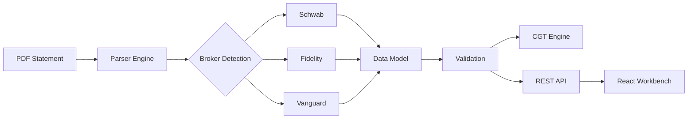

<div align="center">

# ParseFin

### Enterprise-Grade Brokerage Statement Parser

[](https://github.com/jacobp112/ZeroDay/actions/workflows/ci.yml)
[](https://www.python.org/downloads/)
[](LICENSE)

**Transform PDF brokerage statements into structured, actionable data.**

Privacy-first • UK CGT Compliant • Visual Verification UI

[Getting Started](#installation) • [Features](#features) • [API Reference](#rest-api) • [Contributing](#development)

</div>

---

## Overview

ParseFin is a comprehensive platform for extracting, validating, and analysing data from brokerage statements. It combines intelligent PDF parsing with UK tax calculation engines and a modern React-based verification workbench.



## Features

### 🔐 Privacy First
All processing happens **100% locally**. No data ever leaves your machine. No cloud dependencies.

### 📄 Intelligent PDF Extraction
| Method | Description |
|--------|-------------|
| **Native Text** | Fast extraction via PyMuPDF for digital PDFs |
| **Table Recognition** | Structured data extraction from grid formats |
| **OCR Support** | Handles scanned documents (Tesseract) |
| **Spatial Heuristics** | Infers columns for non-standard layouts |
| **LLM Fallback** | Optional AI-powered extraction for edge cases |

### ✅ Data Integrity Validation
- Automatic reconciliation of transaction sums against reported balances
- Orphan transaction detection
- Cash flow verification
- Asset position reconciliation

### 💷 UK Tax Compliance (CGT Engine)
Built-in Capital Gains Tax calculation engine implementing **HMRC Share Identification Rules**:

| Rule | Description |
|------|-------------|
| Same Day | Match sells to buys on the same date |
| Bed & Breakfast | Match sells to buys within 30 days |
| Section 104 Pool | Weighted average cost basis pooling |

Supports stock splits, consolidations, and other corporate actions.

### 🖥️ Reconciliation Workbench
A modern React frontend for visual verification and data correction:

- Side-by-side PDF view with extracted data
- Click-to-highlight source lineage (bounding boxes)
- Inline editing of holdings and transactions
- One-click verification and save

### 📊 Multiple Output Formats
Export to **JSON**, **CSV**, or **Markdown**. Integrates seamlessly with downstream systems.

---

## Supported Brokers

| Broker | Status | Transaction Types | Positions |
|:-------|:------:|:------------------|:----------|
| **Charles Schwab** | ✅ Stable | Buy, Sell, Dividend, Interest, Transfer, Fee | ✅ |
| **Fidelity** | ✅ Stable | Buy, Sell, Dividend, Interest, Transfer, Fee | ✅ |
| **Vanguard** | ✅ Stable | Buy, Sell, Dividend, Interest, Transfer, Fee | ✅ |
| **Generic** | 🔄 Auto | Table-based extraction for any broker | ✅ |

---

## Installation

### Prerequisites
- Python 3.11+
- Node.js 18+ (for frontend)
- Tesseract OCR (optional, for scanned documents)

### Quick Start

```bash
# Clone repository
git clone https://github.com/jacobp112/ZeroDay.git
cd ZeroDay

# Install Python dependencies
poetry install
# or: pip install -e .

# Install frontend dependencies
cd frontend && npm install && cd ..

# Start the API server
uvicorn src.brokerage_parser.api:app --reload --port 8000

# (In another terminal) Start the frontend
cd frontend && npm run dev
```

### OCR Setup (Optional)

For processing scanned documents:

| Platform | Command |
|----------|---------|
| **Windows** | [Download Installer](https://github.com/UB-Mannheim/tesseract/wiki) |
| **macOS** | `brew install tesseract` |
| **Linux** | `sudo apt install tesseract-ocr` |

---

## Usage

### Command Line Interface

ParseFin provides an interactive terminal UI with rich progress tracking.

```bash
# Launch interactive menu
python -m src.brokerage_parser.cli

# Process a single file
brokerage-parser parse statement.pdf -o output.json

# Batch process a directory
brokerage-parser parse statements/ --output results/ --format csv
```

**CLI Options:**

| Option | Description |
|--------|-------------|
| `-o, --output` | Output file or directory |
| `--format` | Output format: `json`, `csv`, `markdown` |
| `--include-sources` | Include bounding box lineage data |
| `-v, --verbose` | Enable debug logging |

### REST API

The API server provides full programmatic access.

#### Parse Statement
```bash
curl -X POST "http://localhost:8000/v1/parse?include_sources=true" \
  -F "file=@statement.pdf"
```

#### Retrieve Stored Report
```bash
curl "http://localhost:8000/v1/documents/{doc_id}/report"
```

#### Verify & Save Corrections
```bash
curl -X POST "http://localhost:8000/v1/documents/{doc_id}/verify" \
  -H "Content-Type: application/json" \
  -d '{"metadata": {...}, "holdings": [...], "transactions": [...]}'
```

**Full API documentation:** [http://localhost:8000/docs](http://localhost:8000/docs)

### Python API

```python
from brokerage_parser import process_statement

# Parse a PDF
statement = process_statement("path/to/statement.pdf", include_sources=True)

# Access extracted data
print(f"Broker: {statement.broker}")
print(f"Account: {statement.account.account_number}")
print(f"Positions: {len(statement.positions)}")
print(f"Transactions: {len(statement.transactions)}")

# Check for integrity warnings
if statement.integrity_warnings:
    for warning in statement.integrity_warnings:
        print(f"⚠️  {warning}")

# Calculate UK CGT
from brokerage_parser.cgt import CGTEngine
engine = CGTEngine()
report = engine.calculate(statement.transactions)
print(f"Total Gains: £{report.total_gains}")
print(f"Total Losses: £{report.total_losses}")
```

---

## Architecture

```
src/brokerage_parser/
├── api.py              # FastAPI REST endpoints
├── cli.py              # Rich terminal interface
├── models.py           # Core data models (Transaction, Position, etc.)
├── orchestrator.py     # Main processing pipeline
├── detection.py        # Broker identification
├── extraction.py       # Text & table extraction
├── storage.py          # Document persistence
├── parsers/
│   ├── schwab.py       # Charles Schwab parser
│   ├── fidelity.py     # Fidelity parser
│   ├── vanguard.py     # Vanguard parser
│   └── generic.py      # Generic table-based parser
├── cgt/
│   ├── engine.py       # HMRC Share Matching Rules
│   ├── pool.py         # Section 104 Pool management
│   └── models.py       # CGT-specific models
├── reporting/
│   ├── engine.py       # Report generation
│   └── markdown.py     # Markdown renderer
└── tax/
    └── wrapper.py      # Tax wrapper detection (ISA, GIA, SIPP)

frontend/
├── src/
│   ├── components/
│   │   ├── Workbench.tsx      # Main verification UI
│   │   ├── PDFViewer.tsx      # PDF display with highlighting
│   │   └── ExtractionPanel.tsx # Editable data tables
│   └── lib/
│       ├── api.ts             # API client
│       └── types.ts           # TypeScript interfaces
```

---

## Development

### Running Tests

```bash
# Run all tests
poetry run pytest

# Run with coverage
poetry run pytest --cov=src/brokerage_parser

# Run specific test file
poetry run pytest tests/test_cgt_engine.py -v
```

### Code Quality

```bash
# Format code
poetry run black src/ tests/

# Lint
poetry run ruff check src/

# Type checking
poetry run mypy src/
```

### Test Coverage

| Module | Coverage |
|--------|----------|
| CGT Engine | 95%+ |
| Parsers | 90%+ |
| API | 85%+ |
| CLI | 80%+ |

---

## Contributing

We welcome contributions! Please follow these guidelines:

1. Fork the repository
2. Create a feature branch (`git checkout -b feature/amazing-feature`)
3. Run tests (`poetry run pytest`)
4. Commit changes (`git commit -m 'Add amazing feature'`)
5. Push to branch (`git push origin feature/amazing-feature`)
6. Open a Pull Request

---

## License

This project is licensed under the MIT License - see the [LICENSE](LICENSE) file for details.

---

<div align="center">

**Built with ❤️ for UK wealth management professionals**

[Report Bug](https://github.com/jacobp112/ZeroDay/issues) • [Request Feature](https://github.com/jacobp112/ZeroDay/issues)

</div>
