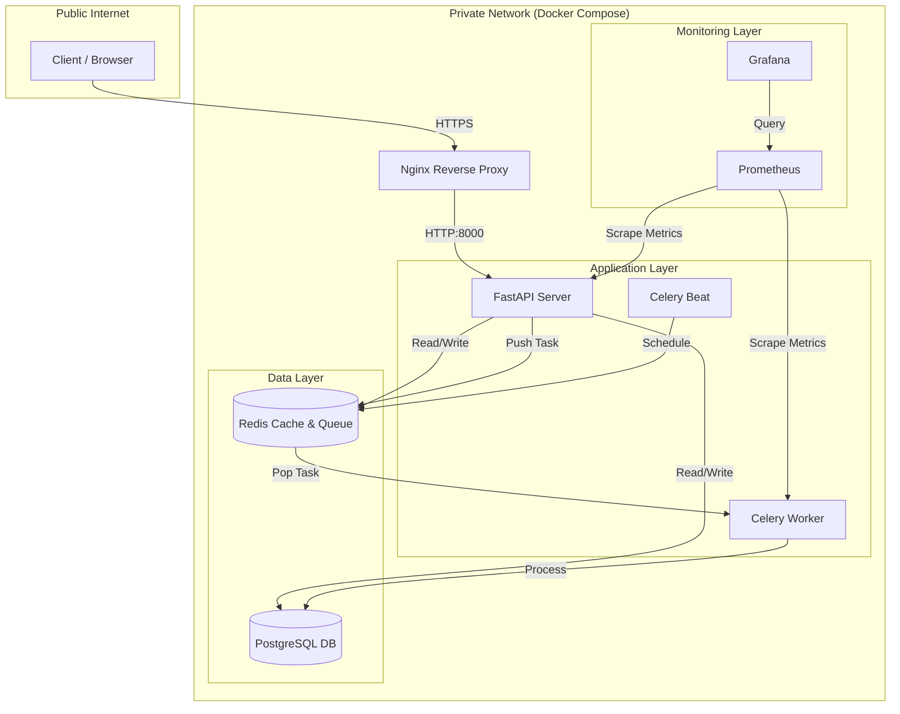
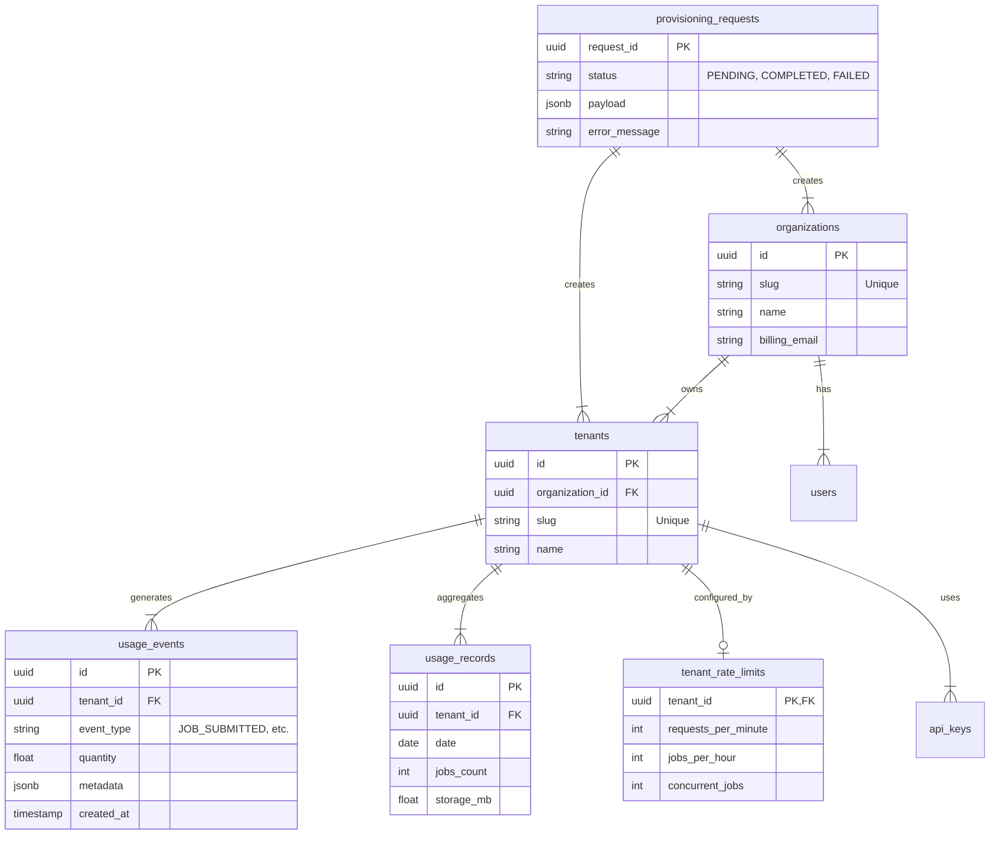
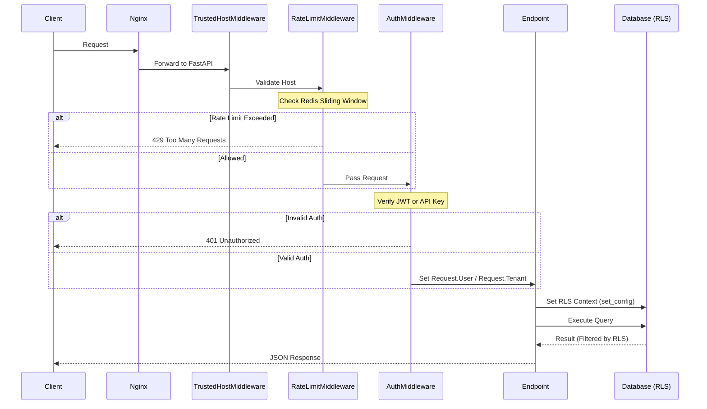
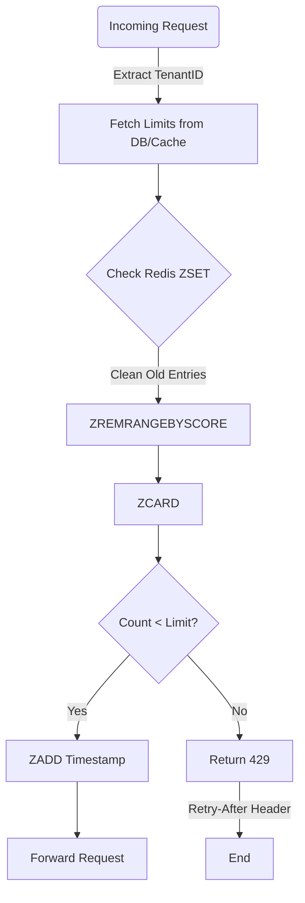
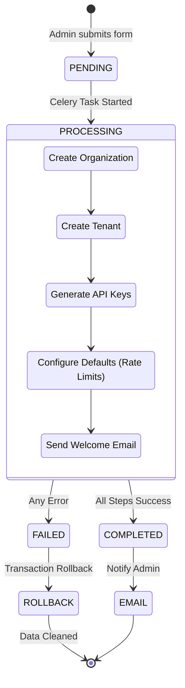
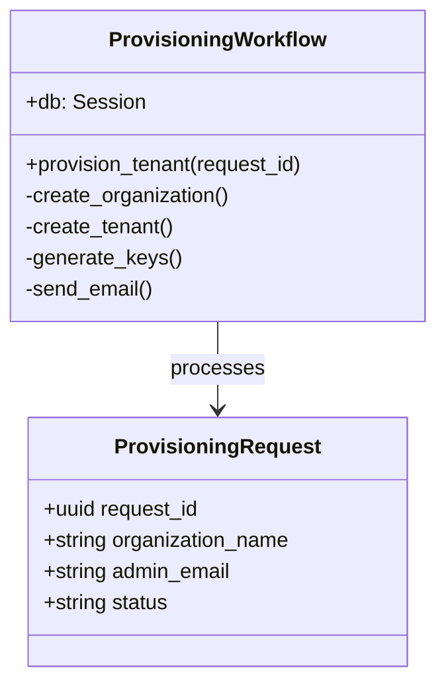
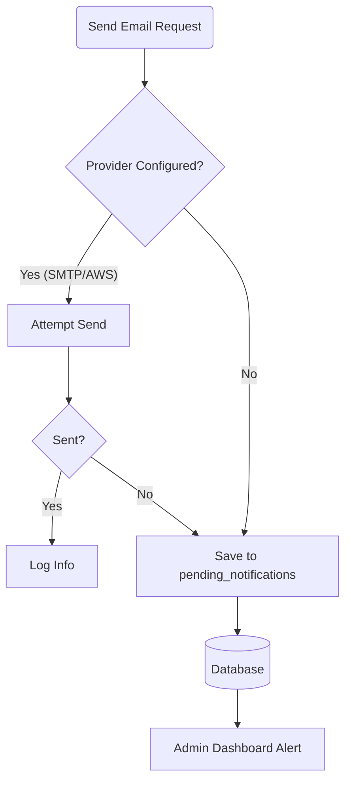
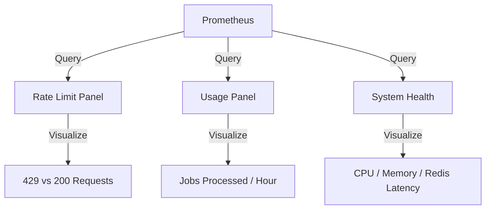

# Technical Design: Operational Excellence (Phase 2)

This document provides a deep-dive technical overview and architectural visualization of the features implemented in Phase 2.

## 1. System Architecture Overview

Phase 2 transformed the system from a simple parser into a scalable SaaS platform by introducing asynchronous processing and high-performance state management.

### Deployment Architecture
The following diagram illustrates the containerized micro-services architecture deployed in Phase 2.



---

## 2. Database Schema (ERD)

Phase 2 introduced tenancy management and metering tables.



---

## 3. Request Processing Pipeline

Every API request flows through a strict middleware pipeline to ensure security and resource governance.



---

## 4. Rate Limiting: Sliding Window Algorithm

We implemented a **Sliding Window** rate limiting algorithm using Redis Sorted Sets (`ZSET`). This provides higher accuracy than fixed windows.

### Algorithm Logic
1.  **Key**: `ratelimit:{tenant_id}:{limit_type}` (e.g., `requests_per_minute`)
2.  **Clean up**: `ZREMRANGEBYSCORE` removes timestamps older than the window (e.g., `now - 60s`).
3.  **Count**: `ZCARD` returns the number of requests currently in the window.
4.  **Decide**:
    - If `count < limit`: `ZADD` current timestamp and allow.
    - If `count >= limit`: Block request.

### Implementation Detail (`rate_limiter.py`)


---

## 5. Usage Metering Pipeline

The metering system uses a "Capture & Aggregate" pattern to handle high write throughput without locking the reporting tables.

```mermaid
graph LR
    subgraph "Real-Time Capture"
        API[API Endpoint] -->|1. Event| Collector[UsageCollector]
        Worker[Celery Worker] -->|1. Event| Collector
        Collector -->|2. BUFFER/INSERT| Events[(usage_events Table)]
    end

    subgraph "Async Aggregation (Hourly)"
        Beat[Celery Beat] -->|3. Trigger| AggTask[aggregate_daily_usage]
        AggTask -->|4. SELECT SUM()| Events
        AggTask -->|5. UPSERT| Records[(usage_records Table)]
    end
```

---

## 6. Automated Application Provisioning

The provisioning workflow orchestrates the creation of all necessary resources for a new customer in a single atomic operation (logically) with rollback capabilities.

### Workflow Logic


### Class Structure (`provisioning/workflow.py`)


---

## 7. Email Service with Fallback

To ensure reliability even without a configured email provider (e.g., in dev/staging), we implemented a database fallback pattern.



---

## 8. Monitoring & Observability

We integrated Prometheus metrics to track the health of these new systems.

### Key Metrics
| Metric Name | Type | Description |
| :--- | :--- | :--- |
| `parselib_rate_limit_exceeded_total` | Counter | Number of 429 responses returned. |
| `parselib_usage_events_total` | Counter | Number of usage events recorded. |
| `parselib_provisioning_duration_seconds` | Histogram | Time taken to provision a new tenant. |
| `parselib_active_tenants` | Gauge | Current number of active tenants. |

### Grafana Dashboard Architecture

